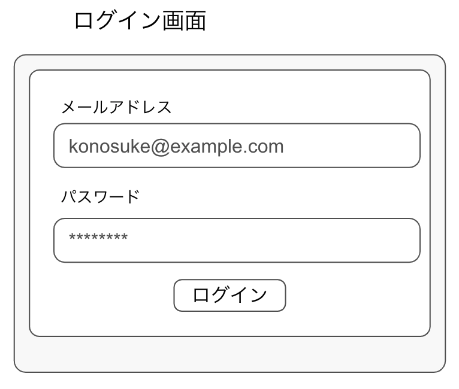
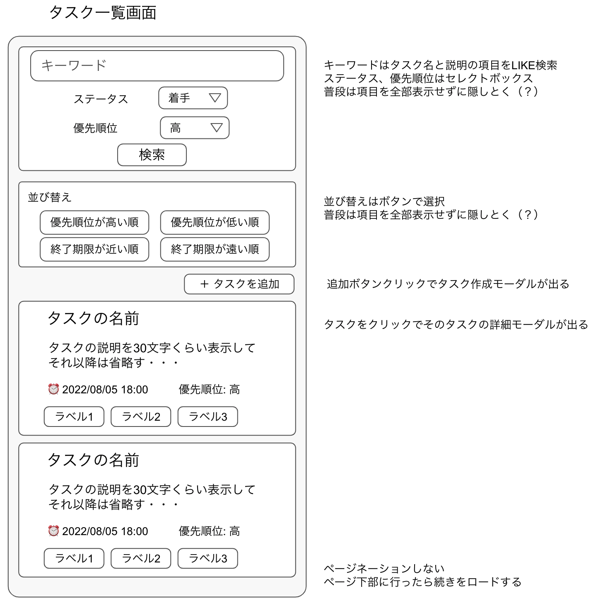
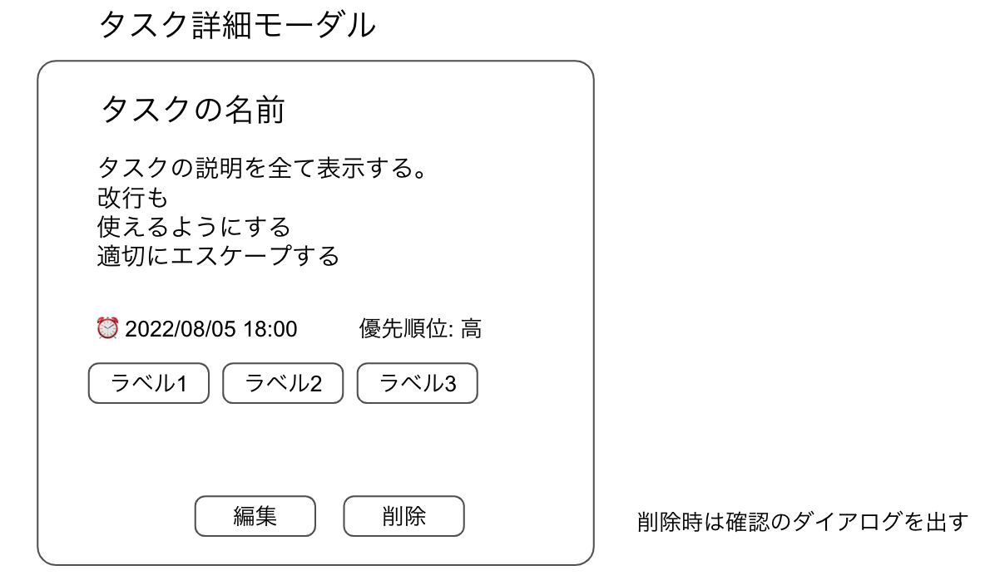
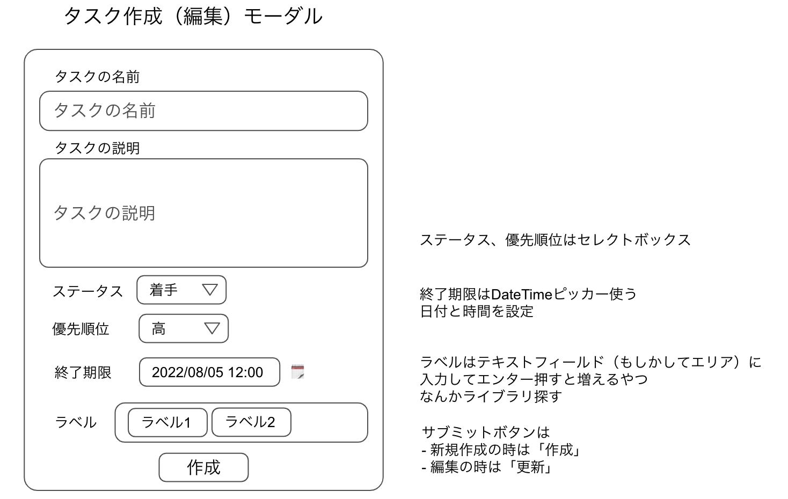

# このアプリがどのような形で利用されるか
- インターネット上に公開する
- 個人が自分のタスクだけ管理するために使う
- プライベートや仕事などラベルで分類できるようにする

# 画面設計
## 画面一覧
### 現時点で作る予定のもの
- ログイン
- タスク一覧（検索込み）
- タスク詳細（モーダル）
- タスク登録（モーダル）

### 現時点で作らないけれど必要だと思ったもの
- ユーザー登録（今回はseedで登録するため）
- パスワード再設定
- メールアドレス認証
- ユーザー一覧（管理者のみ）

## ログイン画面

## タスク一覧画面

## タスク詳細モーダル

## タスク登録モーダル

