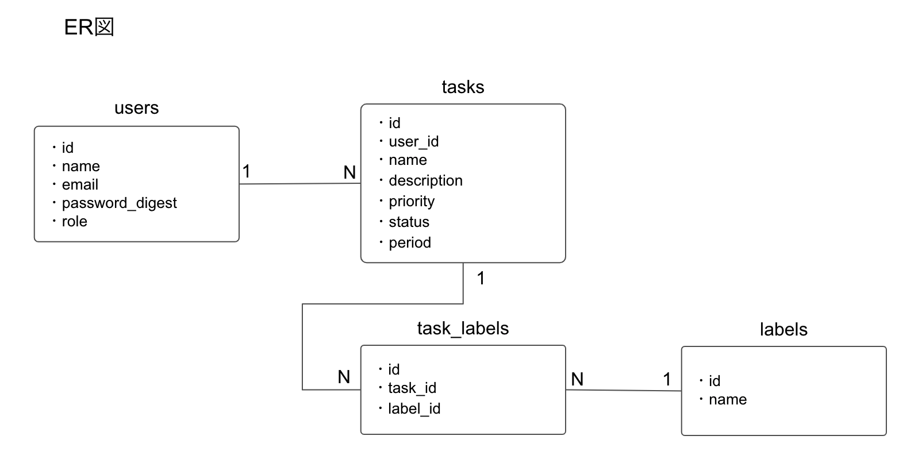

# テーブル一覧
- ユーザーテーブル
- タスクテーブル
- ラベルテーブル
- タスクとラベルの中間テーブル

# ER図

# テーブルスキーマ
## users (ユーザーテーブル)

| カラム名 | データ型 | 日本語名 | 備考 |
| - | - | - | - |
| id | uuid | ID |  |
| name | string | ユーザー名 |  |
| email | string | メールアドレス |  |
| password_digest | string | ハッシュ化したパスワード |  |
| role | integer | ロール | general, adminで管理   今回は必要ないかも |

## tasks (タスクテーブル)

| カラム名 | データ型 | 日本語名 | 備考 |
| - | - | - | - |
| id | uuid | ID |  |
| user_id | uuid | ユーザーID |  |
| name | string | タスク名 |  |
| description | text | 説明文 |  |
| priority | integer | 優先順位 | high, medium, lowで管理 |
| status | integer | ステータス | todo, doing, doneで管理 |
| period | datetime | 終了期限 |  |

## labels (ラベルテーブル)
*今回は必要ないかも*

| カラム名 | データ型 | 日本語名 | 備考 |
| - | - | - | - |
| id | uuid | ID |  |
| name | string | ラベル名 |  |

## task_labels (タスクとラベルの中間テーブル)
*今回は必要ないかも*

| カラム名 | データ型 | 日本語名 | 備考 |
| - | - | - | - |
| id | uuid | ID |  |
| task_id | uuid | タスクID |  |
| label_id | uuid | ラベルID |  |
